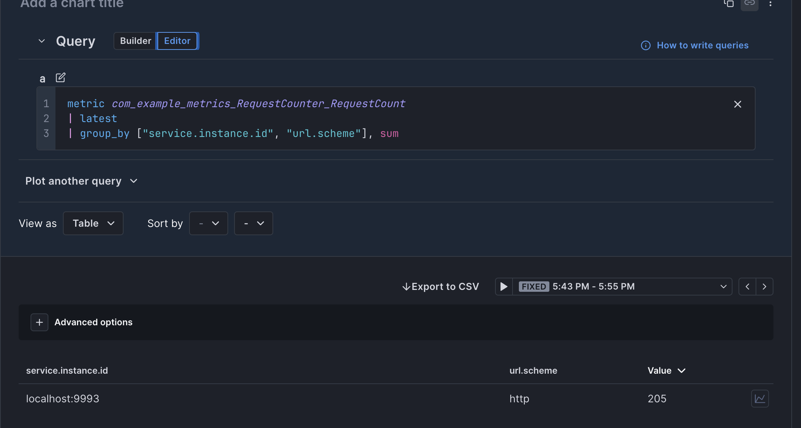

## Overview

Files: 
* SimpleHttpServer.java : Simple HTTP server that increments a counter every time a request is made to http://localhost:8080/

* conf/config.yaml: otel collector config yaml with the prometheus receiver configuration specified

* conf/jmx.yaml: prometheus jmx java agent configuration - this file specifies which metric patterns to include/exclude for collection by the java agent collection

* run_app.sh: a script that will build and compile this simple java application with the prometheus jmx exporter java agent

* run_otel.sh: a script that will start otel with the specified configuration in config/config.yaml


### How it Works

#### Java App
The java application serves JMX metrics to the prometheus java exporter that is configured to run as a java agent alongside the SimpleHttpServer application.

`java -javaagent:./lib/jmx_exporter.jar=9993:./conf/jmx.yaml -jar SimpleHttpServer.jar`

#### JMX Exporter (Prometheus)

The `conf/jmx.yaml` file is used to dictate which MBean objects are queried / excluded from collection.

```yaml
rules:
- pattern: ".*RequestCount.*"
```

* In this case, in our Java Application, we're creating a metric called `com.example.metrics:type=RequestCounter`, so we are capturing the pattern .*RequestCount.* - just to show off that you can use regular expressions to capture one or more MBean metrics.

* The Prometheus JMX Exporter exposes it's `/metrics` endpoint over port 9993 (set with the command line runtime argument):

`java -javaagent:./lib/jmx_exporter.jar=9993:./conf/jmx.yaml -jar SimpleHttpServer.jar`

We can directly query the Prometheus JMX Exporter once the application is running:

```bash
❯ curl http://localhost:9993/metrics  -s | grep Request | tail -n1
com_example_metrics_RequestCounter_RequestCount 208.0 <-- the custom counter that is added in SimpleHttpServer.java
```


### Otel Collector

Since we have this `/metrics` endpoint available through the JMX Exporter, we can now configure our opentelemetry collector's prometheus receiver to gather metrics from this endpoint. 

**config.yaml**
```yaml
receivers:
  prometheus:
    config:
      scrape_configs:
        - job_name: 'jmx-exporter'
          static_configs:
            - targets: ['localhost:9993']

....

service:
  pipelines:
    metrics:
      receivers: [prometheus]
      exporters: [debug,otlp]

```

Once this configuration is in place, the opentelemetry collector will report collected metrics to Cloud Observability.

You may notice that Prometheus converts metric names that contain periods to underscores. For example:




